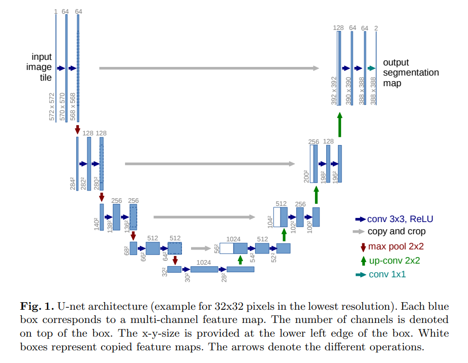
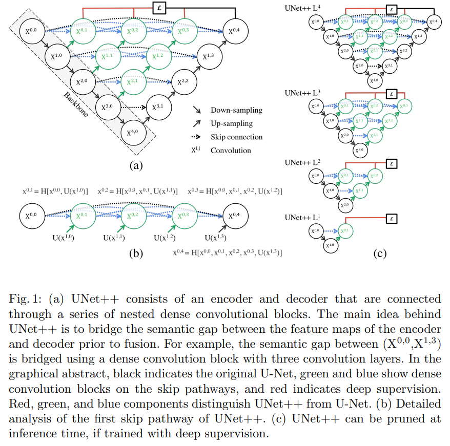
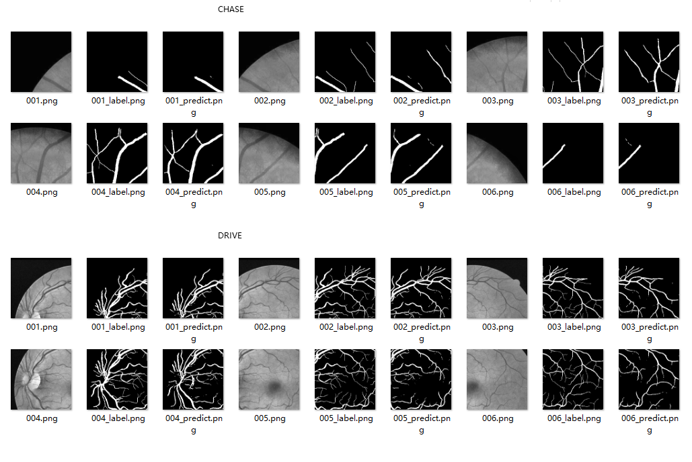
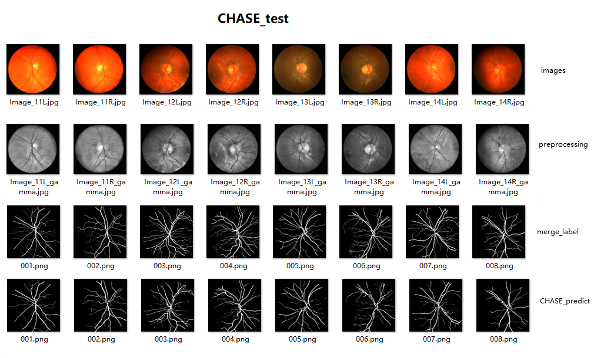
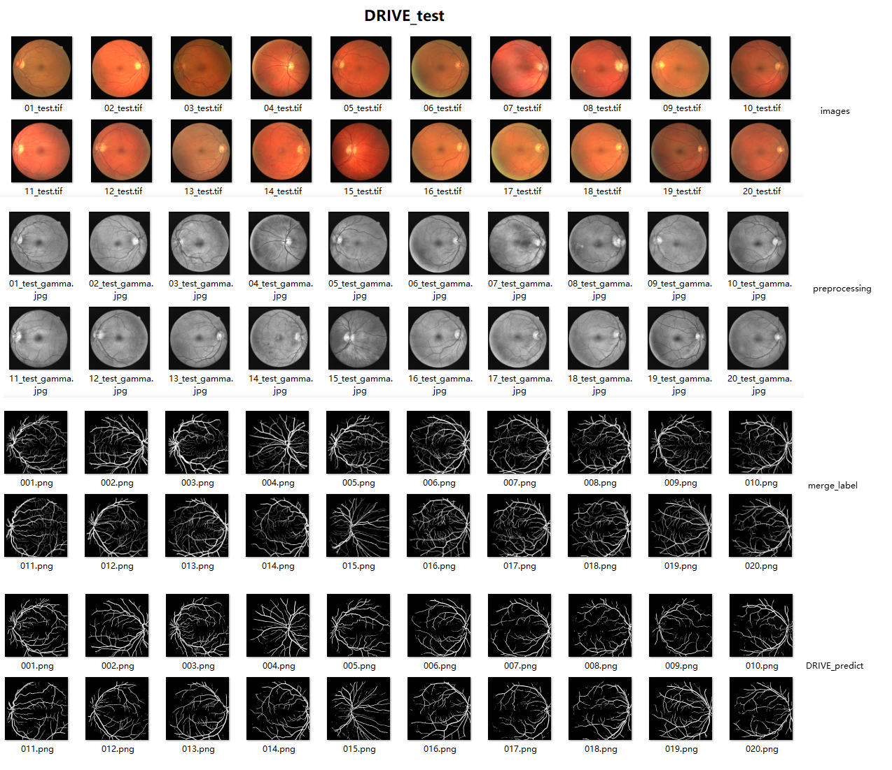

# 简介

## 一、文件目录

```bash
.
│ preprocessing.py              # 4步图像增强
│ get_mask.py                   # 获取感兴趣区域ROI二值化
│ cut_patches.py                # 切成很多小图
│ models.py                     # 存取不同网络模型，暂时用torch写了Unet和Unet++
│ loaddata.py                   # 为训练测试加载数据
│ train_test_evaluate.py        # 训练、预测、评估
│ merge_imgs.py                 # 合并预测的小patchs，合并切割后的label（因为合并切割图像与原label大小并不一样
│ finally_evaluate.py           # 计算整张图像Dice和accuracy两个评价指标
│ README.md
│
├─data
│  ├─CHASE
│  │  ├─test
│  │  │  ├─1st_manual           # 4对，8张
│  │  │  └─images
│  │  └─train
│  │      ├─1st_manual          # 10对，20张
│  │      └─images
│  └─DRIVE
│      ├─test
│      │  ├─1st_manual          # 20张
│      │  └─images
│      └─train
│          ├─1st_manual         # 20张
│          └─images
│
│ ############## 以下文件和文件夹是本人手动加进去的 ############## 
│
├─show_img
│  └─...                        # 4张实验结果展示图
│
├─experiment_log.txt            # 实验运行日志
│
│ ################ 以下数据集是运行代码后期生成的 ################ 
│
├─data_process
│  ├─CHASE
│  │  ├─test                    # 3个文件夹各8张
│  │  │  ├─1st_manual
│  │  │  ├─mask
│  │  │  └─preprocessing
│  │  └─train                   # 3个文件夹各20张
│  │      ├─1st_manual
│  │      ├─mask
│  │      └─preprocessing
│  └─DRIVE
│      ├─test                   # 3个文件夹各20张
│      │  ├─1st_manual
│      │  ├─mask
│      │  └─preprocessing
│      └─train                  # 3个文件夹各20张
│          ├─1st_manual
│          ├─mask
│          └─preprocessing
│
├─data_crop
│  ├─CHASE
│  │  ├─test                    # 8*36*2=576张，增强图+label
│  │  └─train                   # 20*36*2=1440张
│  └─DRIVE
│      ├─test                   # 20*9*2=360张
│      └─train                  # 20*9*2=360张
│
└─result
   ├─CHASE
   │  ├─merge                   # 8张，合并的预测的整个图
   │  ├─merge_label             # 8张，合并的分割的整个label图
   │  └─test                    # 8*36=288张，预测的单个patch图
   └─DRIVE
       ├─merge                  # 20张
       ├─merge_label            # 20张
       └─test                   # 20*9=180张
```

## 二、执行顺序

- [x] preprocessing.py：生成4步（rgb2gray，nomalized，clahe，gamma）图像增强后的图像，保存至 `./data_process/{dataset}/{train_or_test}/preprocessing/{imgname}_gamma.jpg`。
- [x] get_mask.py：生成原始图像的mask，保存至 `./data_process/{dataset}/{train_or_test}/mask/{imgname}_mask.jpg`。
- [x] cut_patches.py：先将`1st_manual`文件夹从`./data/{dataset}/{train_or_test}/`拷贝到`./data_process/{dataset}/{train_or_test}/`，然后将增强图、`1st_manual`（ground_truth）、(mask暂时没切割)分割为指定大小的小patches，分别保存至 `./data_crop/{dataset}/{train_or_test}/{index}`。
- [x] train_test_evaluate.py：调用 models.py，执行网络训练、预测、评估。models.py和loaddata.py是要被调用的两个模块。
- [x] merge_imgs.py: 合并2个数据集的predict和label。
- [x] finally_evaluate.py: 计算 Dice 和Accuracy 测度。

```bash
python preprocessing.py
python get_mask.py
python cut_patches.py

python train_test_evaluate.py train 
python train_test_evaluate.py test 
python train_test_evaluate.py train --batch_size=8 --ckpt='weights_DRIVE_5.pth' --datasetname='DRIVE' 
python train_test_evaluate.py test --ckpt='weights_DRIVE_5.pth' --datasetname='DRIVE' 

python merge_imgs.py         # 注意每次修改5处，每次合并一个数据集的预测图or标签
python merge_imgs.py
python merge_imgs.py
python merge_imgs.py
python finally_evaluate.py
```

## 三、实验思路

- 1.图像预处理：
  - 1）单通道化RGB2Gray
  - 2）归一化
  - 3）对比度限制自适应直方图均衡化
  - 4）伽马校正
- 2.图像分割成小块patch
- 3.torch写网络
  - Unet
  
  - Unet++
  
- 4.训练与测试，计算每个小patch的train_loss和dice_score
- 5.合并图像
- 6.计算整体测度

## 四、实验结果

本人运算资源时间有限，暂时没有进行深入对比试验。`torch.__version__=1.4.0`，`torchvision.__version__=0.5.0`，GPU：天池平台的的 `Tesla V100`，显存有时不到1GB，CPU：天池平台的 `2Core4G`

CHASE数据集用cuda训练batchsize为2，网络采用UNet++，轮数epoch=5，测试集结果：

avarage Dice: **78.03%**, avarage Accuracy: **96.91%**

DRIVE数据集用cpu训练batchsize为8，网络采用UNet，轮数epoch=5，测试集结果：

avarage Dice: **77.45%**, avarage Accuracy: **95.83%**

1.预处理增强步骤图

1）单通道化RGB2Gray 2）归一化 3）对比度限制自适应直方图均衡化 CLAHE 4）伽马校正


2.切分的增强图小块图，小块标签图，小块预测图patch_labelVSpatch_predict



3.CHASE_test



4.DRIVE_test



5.合并后的图计算两个评价指标：Dice 和 Accuracy

```
CHASE No.1, Dice:82.06%, Accuracy:97.71%
CHASE No.2, Dice:81.09%, Accuracy:97.62%
CHASE No.3, Dice:76.20%, Accuracy:96.22%
CHASE No.4, Dice:78.20%, Accuracy:96.52%
CHASE No.5, Dice:77.55%, Accuracy:96.84%
CHASE No.6, Dice:73.54%, Accuracy:96.46%
CHASE No.7, Dice:79.55%, Accuracy:96.93%
CHASE No.8, Dice:76.02%, Accuracy:97.00%
CHASE avarage Dice:78.03%, avarage Accuracy:96.91%
DRIVE No.1, Dice:80.14%, Accuracy:95.85%
DRIVE No.2, Dice:82.00%, Accuracy:96.07%
DRIVE No.3, Dice:75.77%, Accuracy:94.57%
DRIVE No.4, Dice:79.41%, Accuracy:95.84%
DRIVE No.5, Dice:76.71%, Accuracy:95.51%
DRIVE No.6, Dice:74.82%, Accuracy:95.07%
DRIVE No.7, Dice:76.64%, Accuracy:95.71%
DRIVE No.8, Dice:72.05%, Accuracy:95.28%
DRIVE No.9, Dice:70.27%, Accuracy:95.35%
DRIVE No.10, Dice:77.66%, Accuracy:95.96%
DRIVE No.11, Dice:77.46%, Accuracy:95.76%
DRIVE No.12, Dice:76.08%, Accuracy:95.71%
DRIVE No.13, Dice:76.95%, Accuracy:95.40%
DRIVE No.14, Dice:78.46%, Accuracy:96.37%
DRIVE No.15, Dice:79.59%, Accuracy:96.64%
DRIVE No.16, Dice:80.35%, Accuracy:96.23%
DRIVE No.17, Dice:72.79%, Accuracy:95.44%
DRIVE No.18, Dice:77.54%, Accuracy:96.23%
DRIVE No.19, Dice:84.87%, Accuracy:97.00%
DRIVE No.20, Dice:79.51%, Accuracy:96.64%
DRIVE avarage Dice:77.45%, avarage Accuracy:95.83%
```

6.实验日志见 [./experiment_log.txt](./experiment_log.txt)

## 五、参考文献

- [1]	Pizer S M, Amburn E P, Austin J D, et al. Adaptive histogram equalization and its variations[J]. Computer vision, graphics, and image processing, 1987, 39(3): 355-368.
- [2]	Zuiderveld K . Contrast Limited Adaptive Histogram Equalization[J]. Graphics Gems, 1994:474-485.
- [3]	Srinivasan S, Balram N. Adaptive contrast enhancement using local region stretching[C]//Proceedings of the 9th Asian symposium on information display. 2006: 152-155.
- [4]	马青柯. 眼底图像检测和分析系统的设计与开发[D]. 暨南大学.
- [5]	梁礼明, 盛校棋, 郭凯,等. 基于改进的U-Net眼底视网膜血管分割[J]. 计算机应用研究, 2020, v.37;No.342(04):293-297.
- [6]	Jin Q ,  Meng Z ,  Pham T D , et al. DUNet: A deformable network for retinal vessel segmentation[J]. Knowledge-Based Systems, 2019, 178(AUG.15):149-162. https://github.com/RanSuLab/DUNet-retinal-vessel-detection
- [7]	J.V. Soares, J.J. Leandro, R.M. Cesar, H.F. Jelinek, M.J. Cree, Retinal vessel segmentation using the 2-D Gabor wavelet and supervised classification, IEEE Trans. Med. Imaging 25 (9) (2006) 1214–1222.
- [8]	Ronneberger O ,  Fischer P ,  Brox T . U-Net: Convolutional Networks for Biomedical Image Segmentation[M]. Springer, Cham, 2015.
- [9]	Zhou Z ,  Siddiquee M ,  Tajbakhsh N , et al. UNet++: A Nested U-Net Architecture for Medical Image Segmentation[C]// 4th Deep Learning in Medical Image Analysis (DLMIA) Workshop. 2018.
- [10]	Yu F , Wang D , Shelhamer E , et al. Deep Layer Aggregation[C]// 2018 IEEE/CVF Conference on Computer Vision and Pattern Recognition (CVPR). IEEE, 2018.
- [11] https://github.com/wfdubowen/Retina-Unet
- [12] https://github.com/JavisPeng/u_net_liver
- [13] https://github.com/ainieli/UCAS_retina_seg
